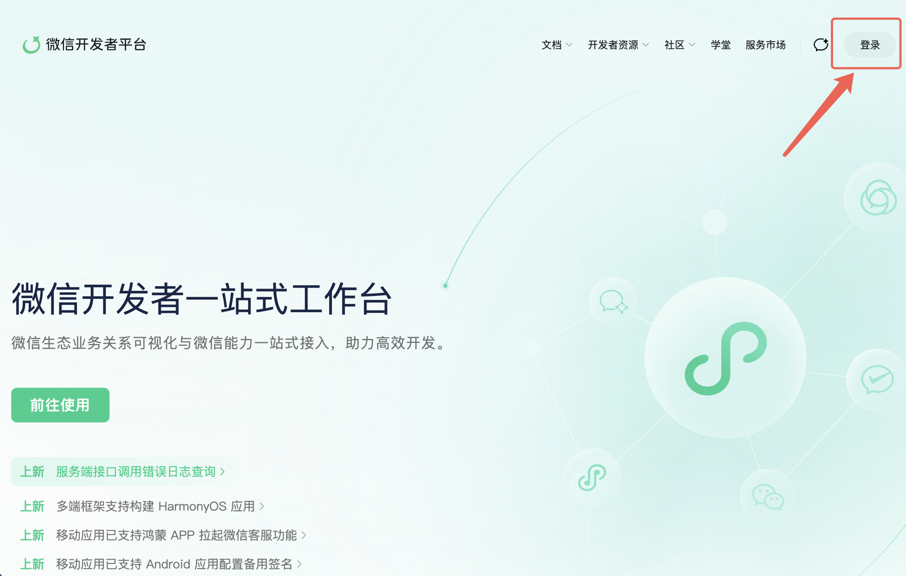
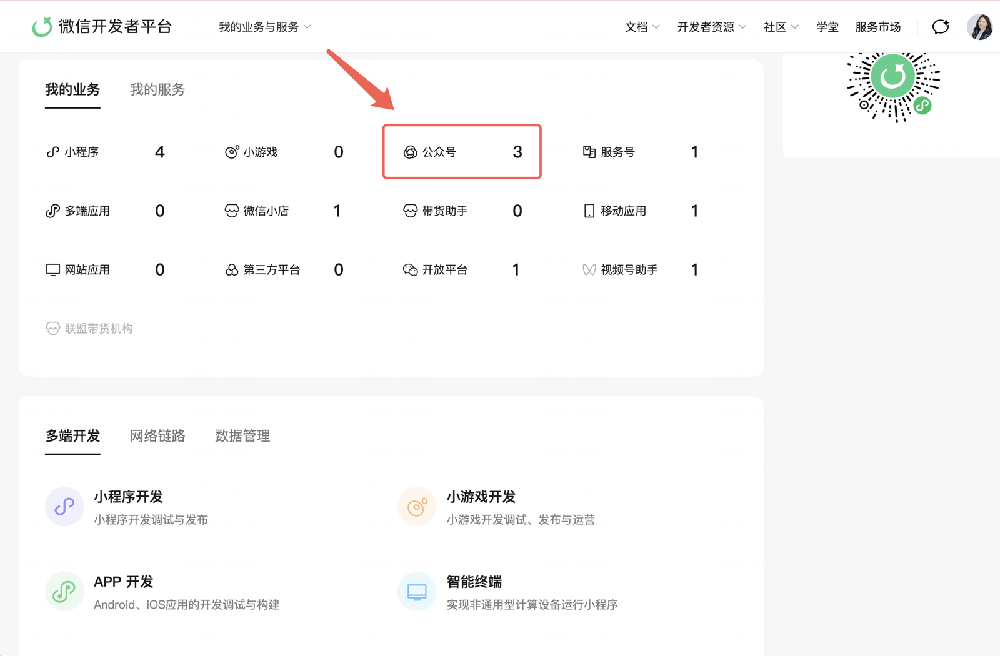
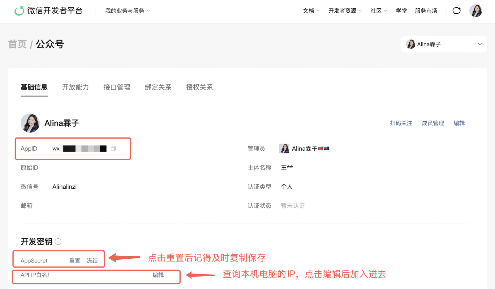

# 公众号一键发布 · 配置指南

> 配置一次，以后在 Obsidian 里写完文章 → 「⚡调用技能 → 发到公众号草稿箱」一键直达。
> 前提：你有自己的微信公众号（**个人订阅号即可，不需要认证**）。
> 你的 AppID / AppSecret 只保存在你自己电脑的插件设置里，**不会上传给 AI霖子服务器**。

整个配置 = 拿两串号码 + 加一个白名单，5 分钟。

---

## 第一步：登录微信开发者平台

打开 [https://developers.weixin.qq.com/platform](https://developers.weixin.qq.com/platform)，点右上角「登录」，用**公众号管理员的微信**扫码。

## 第二步：找到你的公众号

登录后往下滑，在「我的业务」里点「**公众号**」，选择你的公众号进入详情页。

## 第三步：复制 AppID、AppSecret，加 IP 白名单

进入公众号详情页后，对照下图做三件事：

1. **AppID**：「基础信息」里 `wx` 开头那串，点旁边的复制按钮
2. **AppSecret**：往下找「开发密钥」→ 点「**重置**」→ 弹出的密钥**立即复制保存**（只显示这一次）
   - ⚠️ 重置会让旧密钥失效——如果你的公众号在别的工具里也配过密钥，先确认不影响再重置
3. **API IP 白名单**：需要把**你这台电脑的 IP** 加进去，微信才允许发布
   - 查 IP 最简单的方式：Obsidian → 设置 → AI霖子 → 公众号发布区 → 点「**查看本机 IP**」，插件会显示并自动复制
   - 备用方式：浏览器打开 [https://ip.cn](https://ip.cn) 查看
   - 回到微信开发者平台，点「API IP 白名单」右边的「**编辑**」→ 粘贴 IP → 保存

## 第四步：填进插件，开始发布

回到 Obsidian → 设置 → AI霖子 → 「公众号发布」区：

1. 粘贴「公众号 AppID」和「公众号 AppSecret」
2. 打开一篇**带至少一张图片**的文章笔记（第一张图会自动成为封面）
3. 侧边栏 AI霖子 面板 → 「⚡ 调用技能」→「**发到公众号草稿箱**」
4. 看到 ✅ 提示后，去公众号后台 → 草稿箱，预览满意就可以群发了

---

## 常见问题

| 报错 / 现象 | 怎么办 |
|------------|--------|
| 「IP 不在白名单」 | 家里宽带的 IP 隔段时间会变。报错里会直接告诉你新 IP，回到第三步的白名单里再加一次即可（旧的不用删） |
| 「AppSecret 不对或已重置」 | 回到第三步重新「重置」并复制，更新插件设置 |
| 「草稿必须有一张封面图」 | 在文章里插入至少一张本地图片，第一张自动作封面 |
| 不想配置这些 | 用「⚡ 调用技能 →公众号排版:一键复制」，粘贴到公众号后台一样是排好的版式（图片需手动插入） |

遇到解决不了的问题，加开发者 Alina霖子 微信：**AlinaWang321**
