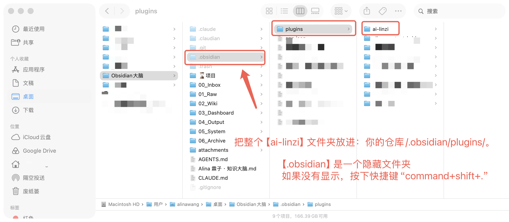
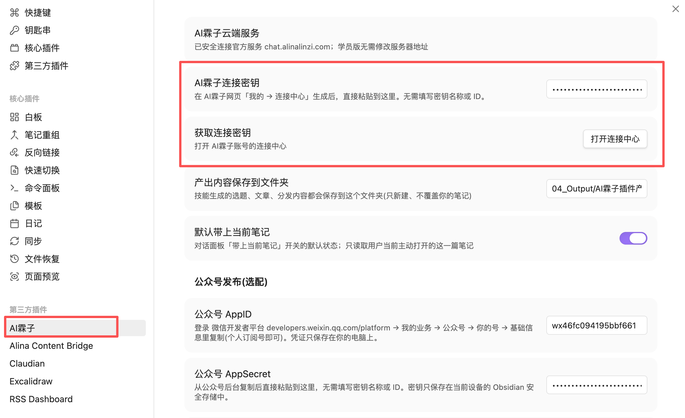

# AI霖子 Obsidian 插件安装说明

> 适用于 Windows、macOS 的 Obsidian 桌面版。请先把 Obsidian 更新到 1.11.4 或以上版本；暂不支持手机版。

## 第一次安装

1. 解压下载的 `ai-linzi.zip`，得到 `ai-linzi` 文件夹。
2. 打开你的 Obsidian 仓库，在电脑文件管理器中显示隐藏文件。
3. 把整个 `ai-linzi` 文件夹放进：`你的仓库/.obsidian/plugins/`。

   

   > macOS 如果看不到 `.obsidian`，请在 Finder 同时按下 `Command + Shift + .` 显示隐藏文件夹。

4. 重启 Obsidian，打开「设置 → 第三方插件」，刷新已安装插件并启用「AI霖子」。
5. 登录 AI霖子网页版，进入「连接中心」，生成一把连接密钥。
6. 回到 Obsidian 的「设置 → AI霖子」，粘贴连接密钥并点击「测试连接」。

   

   > 只需要粘贴网页端生成的连接密钥，不需要填写密钥名称或 ID。

> Windows 显示隐藏文件：文件资源管理器 → 查看 → 显示 → 隐藏的项目

### Windows 看不到 AI霖子时

请打开 `你的仓库/.obsidian/plugins/ai-linzi/`，确认这一层能直接看到：

- `manifest.json`
- `main.js`
- `styles.css`

最终路径必须是：

`你的仓库/.obsidian/plugins/ai-linzi/manifest.json`

如果实际路径是：

`你的仓库/.obsidian/plugins/ai-linzi-obsidian/ai-linzi/manifest.json`

说明 Windows 解压时多套了一层。请把里面的 `ai-linzi` 文件夹移动到 `plugins` 目录，删除外层空的 `ai-linzi-obsidian` 文件夹，然后完全退出并重新打开 Obsidian。

## 以后更新

AI霖子通过 Obsidian 官方插件市场发布后，请在「设置 → 第三方插件」中检查并安装更新。

在官方市场审核通过前，通过 AI霖子网页版连接中心手动安装的用户，可以重新下载最新版并覆盖 `main.js`、`manifest.json` 和 `styles.css`。这个操作不会覆盖你的笔记、账号云端对话或公众号配置。

## 安全说明

- 不需要开启“智能搜索”开关。你明确要求查找 Vault、Obsidian、知识库、数字大脑或文件仓库里的资料时，插件才会临时在本机搜索普通文档，只把回答所需的少量结果交给 AI；不会上传整个 Vault，也不会建立云端全文索引。
- AI 可以分步请求“继续搜索、查看目录、读取某篇文档的一段”，但所有读取都由插件在你的电脑上校验执行，AI 没有直接磁盘权限。工具过程和本地路径不会进入云端聊天历史。
- 当你要求整理、移动或重命名时，AI 只先给方案；你在 Obsidian 二次确认后插件才执行。当前版本不删除文件、不覆盖同名文件，移动/重命名可用命令面板「撤销上一次 AI Vault 整理」恢复。
- 你明确说“处理当前笔记/这篇文章”时，插件只读取仍然打开的一篇 Markdown；关闭标签页立即撤销授权，普通闲聊不读。主动选择的整篇文档、图片修改和公众号发布，仍然只有在你主动选择或确认后才会发送或执行。
- AI霖子连接密钥和公众号 AppSecret 只需直接粘贴，无需填写密钥名称或 ID；它们存在当前设备的 Obsidian 安全存储中，不会写入笔记或上传 GitHub。
- 换电脑后重新安装插件并生成新的连接密钥即可；云端账号、权益和插件对话不依赖原来的电脑。
